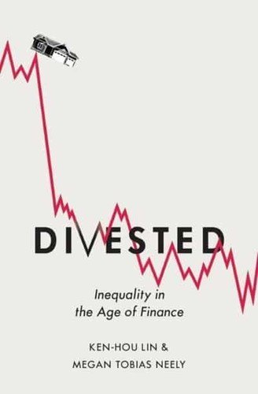
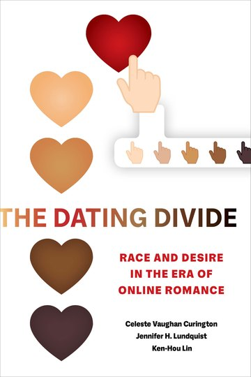

::: {.hero}

{.hero-photo fig-alt="Ken-Hou Lin"}

# Ken-Hou Lin

[Professor of Sociology · University of Texas at Austin]{.tagline}

::: {.hero-contacts}
[](mailto:lin@austin.utexas.edu){title="Email"}
[](https://scholar.google.com/citations?user=4rlcdG0AAAAJ&hl=en){title="Google Scholar"}
[](KHL_CV.pdf){title="CV"}

:::

:::

::: {.section .section-light}
## About {#about}


I study how socio-economic transformations produce inequality across a range of settings — financial markets, workplaces, labor markets, and digital platforms — drawing on statistical and computational methods. Across these projects, I work to advance a relational understanding of inequality that departs from the traditional focus on individual attributes and bring sociological theories and large-scale data into close conversation

My current projects ask what can large language models measure that we have not been able to measure before and how do people reason about a future they cannot know.

:::

::: {.section .section-tint}
## Books {#books}

```{=html}
<div class="books-grid">

  <article class="book">
    <a class="book-cover" href="https://global.oup.com/academic/product/divested-9780190638313" target="_blank" rel="noopener">
      
    </a>
    <div class="book-meta">
      <h3 class="book-title">Divested</h3>
      <p class="book-subtitle">Inequality in the Age of Finance</p>
      <p class="book-authors">(with Megan Tobias Neely)</p>
      <p class="book-byline">Oxford University Press, 2020</p>
      <p class="book-blurb">Finance orders how Americans pursue an education, buy a home, run a
        business, and save for retirement &mdash; and as it has expanded, inequality has soared.
        The book documents how the ascendance of finance on Wall Street, on Main Street, and
        inside households became a fundamental cause of economic inequality, shifting risks once
        shouldered by unions, corporations, and governments onto families.</p>
      <p class="book-note">Finalist, Robert W. Hamilton Book Awards. Translated into Traditional
        Chinese (2021) and Simplified Chinese (2024).</p>
      <p class="book-links">
        <a href="https://global.oup.com/academic/product/divested-9780190638313" target="_blank" rel="noopener">Publisher</a>
        <a href="https://doi.org/10.1093/oso/9780190638313.001.0001" target="_blank" rel="noopener">DOI</a>
      </p>
    </div>
  </article>

  <article class="book">
    <a class="book-cover" href="https://www.ucpress.edu/books/the-dating-divide/paper" target="_blank" rel="noopener">
      
    </a>
    <div class="book-meta">
      <h3 class="book-title">The Dating Divide</h3>
      <p class="book-subtitle">Race and Desire in the Era of Online Romance</p>
      <p class="book-authors">(with Celeste Vaughan Curington and Jennifer Hickes Lundquist)</p>
      <p class="book-byline">University of California Press, 2021</p>
      <p class="book-blurb">The first comprehensive account of <em>digital-sexual racism</em> &mdash;
        a form of racism mediated and amplified by the anonymity of online dating. Drawing on
        behavioral data from more than a million users of a mainstream dating site, archival
        research, and seventy-five in-depth interviews, the book shows how a space often
        celebrated as an equalizer licenses exclusions that rarely surface face to face.</p>
      <p class="book-note">Honorable Mention, Goode Book Award, ASA Family Section.</p>
      <p class="book-links">
        <a href="https://www.ucpress.edu/books/the-dating-divide/paper" target="_blank" rel="noopener">Publisher</a>
        <a href="https://doi.org/10.1525/9780520966703" target="_blank" rel="noopener">DOI</a>
      </p>
    </div>
  </article>

</div>
```
:::

::: {.section .section-light}
## Research {#research}


```{=html}
<div class="publications-layout">
<div id="network-container">
<svg id="pub-network"></svg>
</div>
<div class="filter-panel">
<div id="keyword-chips"></div>
<div class="filter-toggle">
<span>Match:</span>
<label><input type="radio" name="kwmode" value="and" checked> ALL</label>
<label><input type="radio" name="kwmode" value="or"> ANY</label>
<button id="clear-filters">Clear</button>
</div>
<div id="pub-count"></div>
<div id="pub-list"></div>
</div>
</div>
```
:::

::: {.section .section-tint}
## Biography {#bio}

Ken-Hou Lin is Professor of Sociology at the University of Texas at Austin, where he is a
faculty associate of the Population Research Center and holds a courtesy appointment in the
Department of Business, Government and Society at the McCombs School of Business. 

His research examines how large-scale economic transformation — the expansion of finance, the
reorganization of work, and the spread of digital platforms — reshapes the distribution of
resources and opportunity. He is the coauthor of *Divested: Inequality in the Age of Finance*
(Oxford University Press, 2020) and *The Dating Divide: Race and Desire in the Era of Online
Romance* (University of California Press, 2021). His articles appear in the *American Journal
of Sociology*, *American Sociological Review*, *Social Forces*, *Demography*, *Organization
Science*, and the *Annual Review of Sociology*. 

He is Editor-in-Charge of *Socio-Economic Review*, the journal of the Society for the
Advancement of Socio-Economics, and has served as deputy editor of *Demography* and on the
editorial boards of the *American Sociological Review*, the *American Journal of Sociology*,
and *Social Forces*. His research has been supported by the Bill & Melinda Gates Foundation,
the Agency for Healthcare Research and Quality, the Joyce Foundation, the Institute for New
Economic Thinking, and the City of Austin.

He is a recipient of the William Julius Wilson Early Career Award and the Outstanding Article
Award, both from the American Sociological Association's Section on Inequality, Poverty, and
Mobility. He has received the President's Associates Teaching Excellence Award and the
Iverson Award for Innovation in Teaching.


```{=html}
<div class="honors-label">Selected Honors</div>
<dl class="honors">
  <dt>2024</dt>
  <dd>President's Associates Teaching Excellence Award<span>University of Texas at Austin</span></dd>

  <dt>2023</dt>
  <dd>William Julius Wilson Early Career Award<span>ASA Inequality, Poverty, and Mobility Section</span></dd>

  <dt>2022</dt>
  <dd>Iverson Award for Innovation in Teaching<span>University of Texas at Austin</span></dd>

  <dt>2022</dt>
  <dd>Honorable Mention, Goode Book Award<span>ASA Family Section</span></dd>

  <dt>2020</dt>
  <dd>Finalist, Robert W. Hamilton Book Awards<span>University of Texas at Austin</span></dd>

  <dt>2018</dt>
  <dd>Visiting Researcher<span>Max Planck Sciences Po Center on Coping with Instability in Market Societies</span></dd>

  <dt>2016–2017</dt>
  <dd>Barbara Pierce Bush Regents Professorship in Liberal Arts<span>University of Texas at Austin</span></dd>

  <dt>2014</dt>
  <dd>Outstanding Article Award<span>ASA Inequality, Poverty, and Mobility Section</span></dd>
</dl>
```
:::

::: {.section .section-light}

## Contact {#contact}

```{=html}
<dl class="contact-grid">
  <dt>Email</dt>
  <dd><a href="mailto:lin@austin.utexas.edu">lin@austin.utexas.edu</a></dd>

  <dt>Office</dt>
  <dd>Population Research Center<br>University of Texas at Austin</dd>

  <dt>Mail</dt>
  <dd>305 E 23rd St, Stop G1800<br>Austin, TX 78712</dd>

  <dt>Scholar</dt>
  <dd><a href="https://scholar.google.com/citations?user=4rlcdG0AAAAJ&amp;hl=en">Google Scholar profile</a></dd>
</dl>
```
:::
